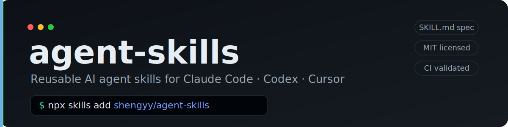
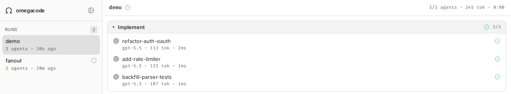

# agent-skills

> shengyy 的 AI agent skills 合集 —— 给 Claude Code、Codex 等编码 agent 用的可复用技能。

[English](README.md) | **简体中文**

[](https://github.com/shengyy/agent-skills/releases)
[](LICENSE)
[](https://github.com/shengyy/agent-skills/actions/workflows/validate-skills.yml)
[](https://skills.sh/)

遵循通用 [Agent Skills](https://github.com/anthropics/skills) 格式（每个 skill 一个 `SKILL.md`），用 [`skills`](https://www.npmjs.com/package/skills) CLI 一条命令即可安装，跨 Claude Code / Codex / Cursor 等多种 agent 通用。

## 安装

```bash
# 安装全部 skill（全局，所有项目可用）
npx skills add shengyy/agent-skills -g --all

# 只装某一个
npx skills add shengyy/agent-skills -g --skill codex-dev

# 先看看仓库里有哪些 skill（不安装）
npx skills add shengyy/agent-skills -l
```

- `-g` 装到用户全局；去掉 `-g` 则只装进**当前项目**的 `.claude/skills/`。
- 安装后新开一个会话即可生效，在 Claude Code 里用 `/<skill-name>` 或自然语言触发。
- 更新：`npx skills update -g`；卸载：`npx skills remove -g -s <skill-name>`。

## Available Skills

| Skill | 说明 | 前置依赖 |
|---|---|---|
| [`codex-dev`](skills/codex-dev/) | 把开发任务派发给 OpenAI Codex CLI 实施的通用闭环：Claude 出方案写任务书、编排并发、机械验收 + 评审 + 合并提交；codex 在 `workspace-write` 沙箱里写代码。 | `codex` CLI（必需）、`omegacode`（并发轨可选） |
| [`codex-dev-native`](skills/codex-dev-native/) | 同一套派工闭环，改跑**官方 Codex 插件的原生 `codex-companion` 引擎**（不用 omegacode）：Claude 编排 + 评审 + 合并，codex 在 `workspace-write`（写限 cwd、开网）里实施。起任务 / 后台 / status / result / cancel / 续跑全是原生。 | `codex` CLI + `codex@openai-codex` Claude Code 插件 |

### codex-dev

派工开发闭环：Claude 负责出方案、写任务书、编排（串行 `codex exec` / 并发 `omegacode` + worktree 物理隔离）、验收评审、合并提交；codex 只负责在沙箱里实施。流程自动推进，只在 BLOCKED、合并冲突需裁决或越权时停下来问人。

**前置依赖**（skill 本身只是编排器，真正干活的工具需自行装好）：

```bash
# 1. codex CLI（必需）
npm install -g @openai/codex
codex login

# 2. omegacode（仅并发轨需要，可选）
npm install -g omegacode
omegacode doctor   # 验证 codex worker 就绪
```

> 沙箱说明：派工命令内部已强制 `-s workspace-write`，不依赖全局默认。若本机 `~/.codex/config.toml` 设了 `danger-full-access`，知悉即可，skill 会显式覆盖。

> 模型说明：任务默认跑在 **`gpt-5.5`**，推理力度按任务分档（`medium` / `high` / `xhigh`）。要换模型，直接改 skill 里的 `model` / `defaultModel` 即可。

并发轨是 **detached 后台任务，自带实时 dashboard**——关掉终端 run 照样在跑，任何新会话凭落盘的 runId 就能重连（不靠 watcher 进程续命）。



### codex-dev-native

与 `codex-dev` 同一套派工闭环，区别只在**执行引擎换成官方 Codex 插件**（`codex@openai-codex`），不再用 omegacode。Claude 依旧负责编排、机械验收、亲自评审、合并；codex 依旧只实施。底层的起任务、后台执行、status / result / cancel、同线程续跑——全部交给插件的**每仓库原生注册表**，所以这个 skill 不带任何手搓的派工管道。原生 job 是**会话作用域**（不跨 Claude 会话存活）；skill 如实照搬这一点，不另建跨会话恢复。

**前置依赖：**

```bash
# 1. codex CLI（必需）
npm install -g @openai/codex
codex login

# 2. 官方 Codex 插件（这就是引擎）
claude plugin install codex@openai-codex --scope user
```

> 沙箱：codex 跑在 `workspace-write`（插件给写任务的唯一模式）——写被限在任务 cwd 内、OS 挡住越界。要让 codex 联网查资料 / 装依赖，在 `~/.codex/config.toml` 给该模式开网：
>
> ```toml
> [sandbox_workspace_write]
> network_access = true
> ```
>
> 只在 workspace-write 激活时生效，不影响你的交互式 codex。

**无守护进程的并发：** Claude 起 N 个原生后台任务（每 worktree 一个），用 `status <id> --wait` / `result` 等待。没有单独 dashboard 进程。原生 job 是**会话作用域**——插件在 `SessionEnd` 结束它们，不跨 Claude 会话存活，skill 不另加跨会话层。要让长任务跨会话存活，用 omega 的 `codex-dev`。

**codex-dev 还是 codex-dev-native——按引擎选：**

| | `codex-dev` | `codex-dev-native` |
|---|---|---|
| 引擎 | omegacode | 官方 `codex@openai-codex` 插件 |
| 并行 fan-out | omega `parallel()` + 实时网页 dashboard | Claude 编排 N 个原生后台任务 |
| 跨会话恢复 | runId + `run.json` → `--resume` | 无 —— 原生 job 是会话作用域 |
| 额外依赖 | `omegacode` | codex 插件 |

装了官方插件就优先用 `codex-dev-native`；想要 omega 的实时 dashboard、或已经在 omega 上跑，就留 `codex-dev`。

## Usage

```bash
# 安装后，在 Claude Code 会话里：
/codex-dev 把 src/auth 的登录流程重构成 OAuth          # omegacode 引擎
/codex-dev-native 把 src/auth 的登录流程重构成 OAuth   # 原生 codex 插件引擎
# 或自然语言："丢给 codex 实现 XXX" / "并发派几个 codex 做 A、B、C"
```

## 仓库结构

```
agent-skills/
├── README.md               # English
├── README.zh-CN.md         # 简体中文
├── CONTRIBUTING.md         # 加新 skill 的规范流程
├── CHANGELOG.md
├── LICENSE
├── assets/banner.svg
├── scripts/
│   └── validate_skills.py  # 本地 / CI 共用的 SKILL.md 校验
├── .github/
│   ├── workflows/validate-skills.yml
│   └── pull_request_template.md
└── skills/
    ├── codex-dev/
    │   └── SKILL.md        # 跑 omegacode 引擎的派工闭环
    └── codex-dev-native/
        └── SKILL.md        # 跑原生 codex 插件引擎的派工闭环
```

每个 skill 自成一个 `skills/<name>/` 目录，至少含一个 `SKILL.md`；如有需要可附 `scripts/`、`references/` 等子目录，随安装一起带走。

## 添加新 skill

```bash
# 1. 初始化骨架
npx skills init skills/<new-skill-name>

# 2. 编辑 SKILL.md（name 必须等于目录名，description 写清触发场景）

# 3. 本地校验
python3 scripts/validate_skills.py
```

完整规范见 [CONTRIBUTING.md](CONTRIBUTING.md)。提交推送后，任何人都能用
`npx skills add shengyy/agent-skills -g --skill <new-skill-name>` 装上。

## 贡献

欢迎提 PR。流程与约定见 [CONTRIBUTING.md](CONTRIBUTING.md)，变更历史见 [CHANGELOG.md](CHANGELOG.md)。

## License

[MIT](LICENSE) © 2026 shengyy
