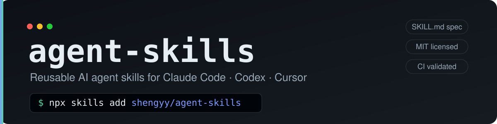

# agent-skills

> shengyy 的 AI agent skills 合集 —— 给 Claude Code、Codex 等编码 agent 用的可复用技能。

[English](README.md) | **简体中文**

[](https://github.com/shengyy/agent-skills/releases)
[](LICENSE)
[](https://github.com/shengyy/agent-skills/actions/workflows/validate-skills.yml)
[](https://skills.sh/)

遵循通用 [Agent Skills](https://github.com/anthropics/skills) 格式（每个 skill 一个 `SKILL.md`），用 [`skills`](https://www.npmjs.com/package/skills) CLI 一条命令即可安装，跨 Claude Code / Codex / Cursor 等多种 agent 通用。

## 安装

```bash
# 安装全部 skill（全局，所有项目可用）
npx skills add shengyy/agent-skills -g --all

# 只装某一个
npx skills add shengyy/agent-skills -g --skill codex-construction

# 先看看仓库里有哪些 skill（不安装）
npx skills add shengyy/agent-skills -l
```

- `-g` 装到用户全局；去掉 `-g` 则只装进**当前项目**的 `.claude/skills/`。
- 安装后新开一个会话即可生效，在 Claude Code 里用 `/<skill-name>` 或自然语言触发。
- 更新：`npx skills update -g`；卸载：`npx skills remove -g -s <skill-name>`。

## Available Skills

| Skill | 说明 | 前置依赖 |
|---|---|---|
| [`codex-construction`](skills/codex-construction/) | 主代理出方案、Codex 裸调 `codex exec` 施工的轻量派工编排：分批派工、后台三态监控、分阶段 commit + 验收包、改-审循环。主代理放权 + 监工过度工程，其余全交给模型。 | `codex` CLI（已登录） |

### codex-construction

**前置依赖：**

```bash
npm install -g @openai/codex
codex login
```

在一次真实的整日架构重构（6 阶段、净删万余行、三轮长时施工无一卡死）中打磨成型，
随后沉淀为 skill。要换模型/推理力度，直接改 SKILL.md 调用一节的那一行。

## 设计哲学（v0.3 起）

v0.2 的 `codex-dev` / `codex-dev-native` 是给老一代模型写的：沙箱管道、写权限
allowlist、任务书模板、并发 registry……大量篇幅在替引擎和模型做它们如今自己能做好的事，
也是「总断、不反馈」的根源。

新一代模型（GPT‑5.6+ / Claude 5+）能力过剩，编排的价值收敛为三件事：**分工、边界、验收**。
所以 v0.3 用一个约百行的 `codex-construction` 整体替换两个旧 skill：

- **放权**：codex 一批之内全自主（读合同、实现、跑门禁、commit、写验收包），
  prompt 只给「现场 / 合同指针 / 范围 / 真红线 / 边界与交付」五要素；
- **监工**：codex 独立干活的系统性偏差是过度工程——主代理只在方案裁决、
  分批验收、BLOCKED 裁决三个点介入，不管过程；
- **约束越少越好**：实现细节约束越多，模型被迫选次级方案的概率越大。
  发现真实问题允许 codex 在范围内自行根因修复，记入验收包即可。

## 贡献

见 [CONTRIBUTING.md](CONTRIBUTING.md)。每个 skill 必须通过
`python scripts/validate_skills.py` 的结构校验。

## License

[MIT](LICENSE)
