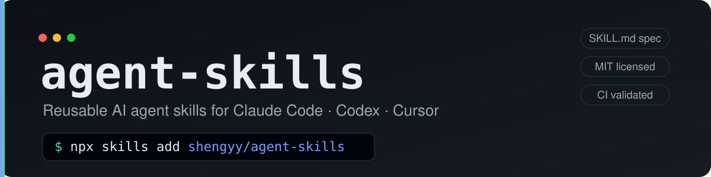

# agent-skills

> shengyy 的 AI agent skills 合集 —— 给 Claude Code、Codex 等编码 agent 用的可复用技能。

[English](README.md) | **简体中文**

[](https://github.com/shengyy/agent-skills/releases)
[](LICENSE)
[](https://github.com/shengyy/agent-skills/actions/workflows/validate-skills.yml)
[](https://skills.sh/)

遵循通用 [Agent Skills](https://github.com/anthropics/skills) 格式（每个 skill 一个 `SKILL.md`），用 [`skills`](https://www.npmjs.com/package/skills) CLI 一条命令即可安装，跨 Claude Code / Codex / Cursor 等多种 agent 通用。

本文负责仓库介绍、安装入口与文档和目录地图。各 skill 的行为由其 `SKILL.md` 拥有，贡献与发版流程见 [CONTRIBUTING.md](CONTRIBUTING.md)。

## 安装

```bash
# 安装全部 skill（全局，所有项目可用）
npx skills add shengyy/agent-skills -g --all

# 只装某一个
npx skills add shengyy/agent-skills -g --skill codex-construction

# 先看看仓库里有哪些 skill（不安装）
npx skills add shengyy/agent-skills -l
```

- `-g` 装到用户全局；去掉 `-g` 则只装进**当前项目**的 `.claude/skills/`。
- 安装后新开一个会话即可生效，在 Claude Code 里用 `/<skill-name>` 或自然语言触发。
- 更新：`npx skills update -g`；卸载：`npx skills remove -g -s <skill-name>`。

## Available Skills

| Skill | 说明 | 前置依赖 |
|---|---|---|
| [`codex-construction`](skills/codex-construction/SKILL.md) | 简报驱动的派工编排：主代理写好简报（背景、交付、重点、质量与资源、风格与品味）后放手，判断交给模型、只守红线与 CLI 实测事实，Codex 裸调 `codex exec` 施工；effort 按 medium / high / xhigh 三档派、后台监控、对照简报验收、改-审循环。Codex 负责实现，主代理负责简报与验收。 | `codex` CLI（已登录） |

### codex-construction

**前置依赖：**

```bash
npm install -g @openai/codex
codex login
```

模型选择与 CLI 调用见 skill 的[「启动」](skills/codex-construction/SKILL.md#启动)，推理力度见[「档位」](skills/codex-construction/SKILL.md#档位)。

## 设计哲学

当前一代编码模型能力有富余，把实现细节钉得越死，越容易逼它选次级方案；真正决定结果的是**清楚的目标和足够高的门槛**。所以主代理的功夫花在简报和验收上，不花在过程管控上。

- **事实写死，判断放开**：硬规则只有不可逆的动作边界和 CLI 实测事实；简报篇幅、拆批、档位、审几轮由主代理判断，设计、实现、测试和可逆取舍由 Codex 判断。担心的偏差写成「说明为什么值得」，不写成禁令。
- **像给顶尖工程师交代任务那样写简报**：背景与动机、交付物长什么样、什么最重要、质量门槛和达到它所需的资源与授权、期望的风格与品味；另附红线和固定的运行约定。
- **对照简报验收**：亲自验证交付，确认重点真的落地，读 diff 判断质量与品味，逐条看 Codex 自主做出的判断；只有不可逆的决定和排除不了的阻塞通过 BLOCKED 交回主代理。

执行规则由 skill 的[「原则」](skills/codex-construction/SKILL.md#原则)、[「分工」](skills/codex-construction/SKILL.md#分工)、[「写简报」](skills/codex-construction/SKILL.md#写简报)、[「验收」](skills/codex-construction/SKILL.md#验收)与[「改-审循环」](skills/codex-construction/SKILL.md#改-审循环)负责。

## 文档地图

| 文件 | 职责 |
|---|---|
| [README.md](README.md) | 英文仓库介绍、安装入口与文档和目录地图。 |
| [README.zh-CN.md](README.zh-CN.md) | README 的中文同步版本。 |
| [AGENTS.md](AGENTS.md) | 共用的仓库约定与任务路由。 |
| [CLAUDE.md](CLAUDE.md) | 导入共用约定，补充 Claude Code 的本地 memory 边界。 |
| [codex-construction/SKILL.md](skills/codex-construction/SKILL.md) | 简报结构、派工、effort 档位、CLI 操作与验收。 |
| [CONTRIBUTING.md](CONTRIBUTING.md) | 新增 skill、本地试装、贡献与发版流程。 |
| [pull_request_template.md](.github/pull_request_template.md) | PR 改动说明与检查清单；贡献流程由 CONTRIBUTING.md 负责。 |
| [CHANGELOG.md](CHANGELOG.md) | 版本历史与待发布变更。 |
| [VERSION](VERSION) | 当前发布版本号。 |
| [LICENSE](LICENSE) | MIT 授权条款。 |

## 目录地图

| 目录 | 职责 |
|---|---|
| [仓库根目录](.) | 仓库入口与声明：Agent 指引、双语 README、贡献指南、变更记录、版本、授权与本地产物忽略规则。 |
| [`.github/`](.github/) | GitHub 协作与自动化：PR 模板和校验 workflow。 |
| [`.github/workflows/`](.github/workflows/) | CI 定义；当前 workflow 调用仓库的 skill 校验脚本。 |
| [`assets/`](assets/) | README 展示素材；随 skill 分发的素材归各 skill 安装包。 |
| [`scripts/`](scripts/) | 仓库级门禁（`validate_skills.py` 校验 skill 结构与 frontmatter）；随 skill 分发的脚本归各 skill 安装包。 |
| [`skills/`](skills/) | 可安装的 skill 包；包内结构见[仓库约定](AGENTS.md#仓库约定)。 |
| [`skills/codex-construction/`](skills/codex-construction/) | codex-construction 安装包。 |

## 贡献

见 [CONTRIBUTING.md](CONTRIBUTING.md)。每个 skill 必须通过
`python3 scripts/validate_skills.py` 的结构校验。

## License

[MIT](LICENSE)
